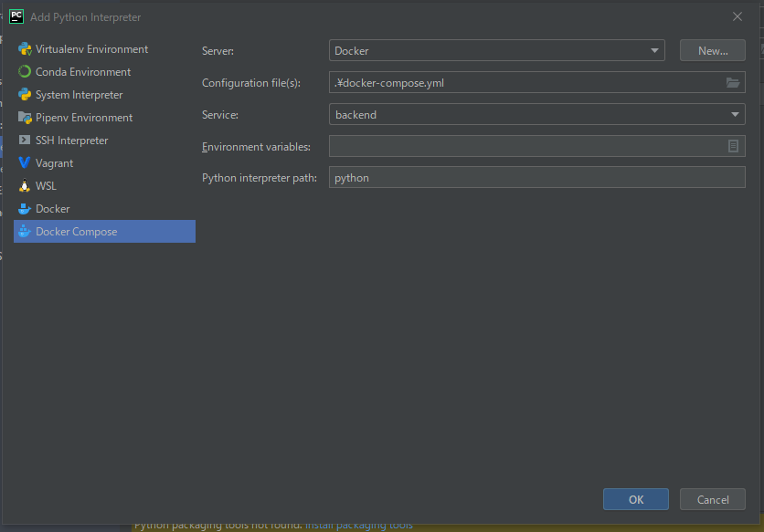
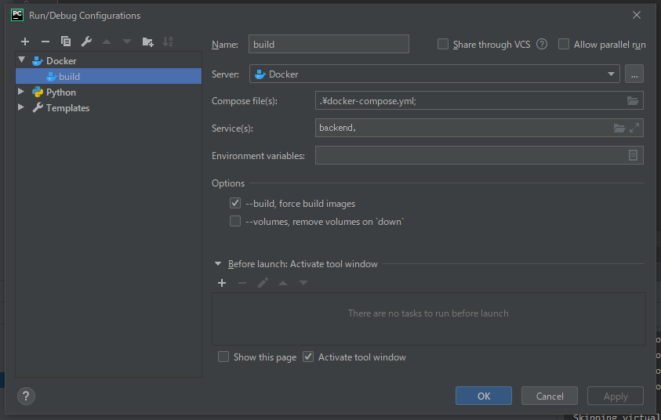

# コンテナ概要
centos上のpython実行環境で、fastapiを利用したrest apiバックエンドの利用を想定しています。
npmも含まれており、javascriptのモジュールをインストールすることができます。
詳しくは以下を参照ください。

- [dockerhub](https://hub.docker.com/r/centos/python-36-centos7)

# How to build

``` bash
# create image from Dockerfile in current directory.
docker build -t <username>/imagename .

# run as background(-d) and bind port(-p publish:dest to port forward)
docker run -p 8080:80 -d <username>/imagename

```

# how to use pycharm(pro)

## settings -> Project:Interpreter -> add からProject Interpreterを構成する


## Edit Configurationsからdocker composeを構成する



https://docs.python.org/ja/3/using/cmdline.html#environment-variables
